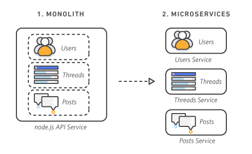

# Benefits

* Simplifies continuous delivery and deployment of large, complex applications
* Promotes testability: services are smaller and faster to test
* Reduces cost and risk of deployment: each micro-service can be deployed independently
* Allows organization to organize the development effort in smaller, more autonomous teams
* Reduces long-term commitment to a technology stack and, possibly, to protocols
* Facilitates fault isolation