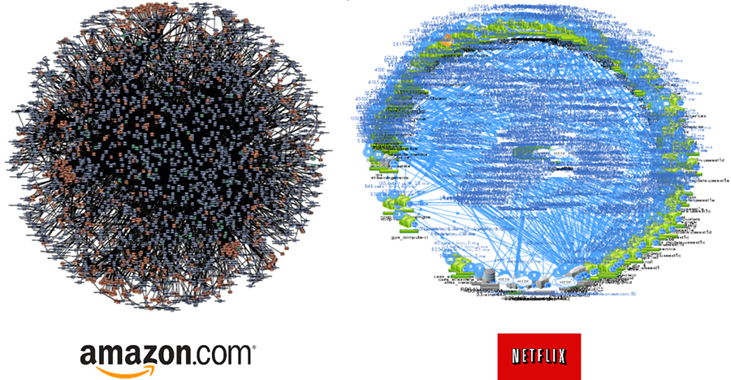

# History

* Dr. Peter Rodgers introduced the term "Micro-Web-Services" during a presentation at the [Web Services Edge conference in 2005](http://www.microserviceworld.com/p/history.html)
* Mentioned at workshop near [Venice in year 2011](https://dzone.com/articles/microservices-vs-soa-is-there-any-difference-at-al)
* [microservices.io registered in 2014](https://www.whois.com/whois/microservices.io)
* The principals and guidance spelled out in details [2014](https://martinfowler.com/articles/microservices.html)
* Netflix publishes a [blog](https://www.nginx.com/blog/microservices-at-netflix-architectural-best-practices/) in 2015 about its adoption
* 2016: Death Star of Micro-services implementation

* In 2018 an article is published about a "huge improvement" going [from micro-services to monolith](https://twitter.com/dhh/status/1016783191309520896?lang=en)
