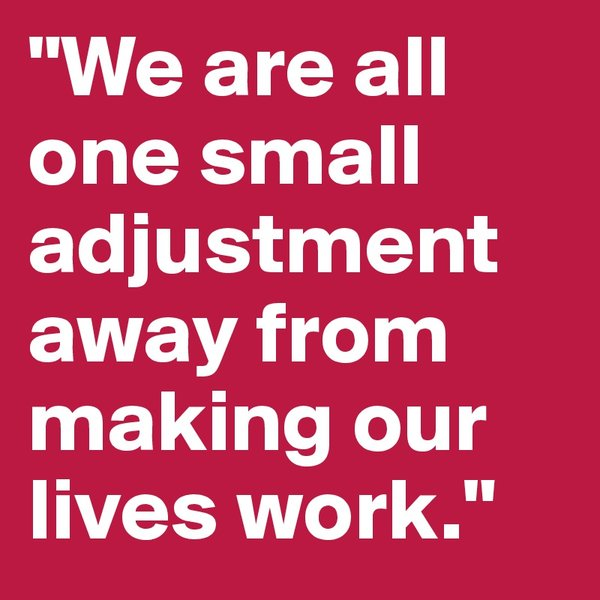

# A "small" adjustment?

<table style="border:0">
  <tr style="border:0">
    <td style="border:0">
      
    </td>
    <td style="border:0">
      <ul>
        <li>Care about business agility?</li>
        <li>Need an speed up build, test, deploy, and release cycles?</li>
        <li>Interesting cost reduction for maintaining and monitoring environments?</li>
        <li>Enjoy to maintain a legacy software?</li>
        <li>Got a great cooperation among architects, devs, testers, security and ops?</li>
        <li>Software architecture, in principals, stays the same, as the technology has evolved?</li>
     </ul>
    </td>
  </tr>
</table>
